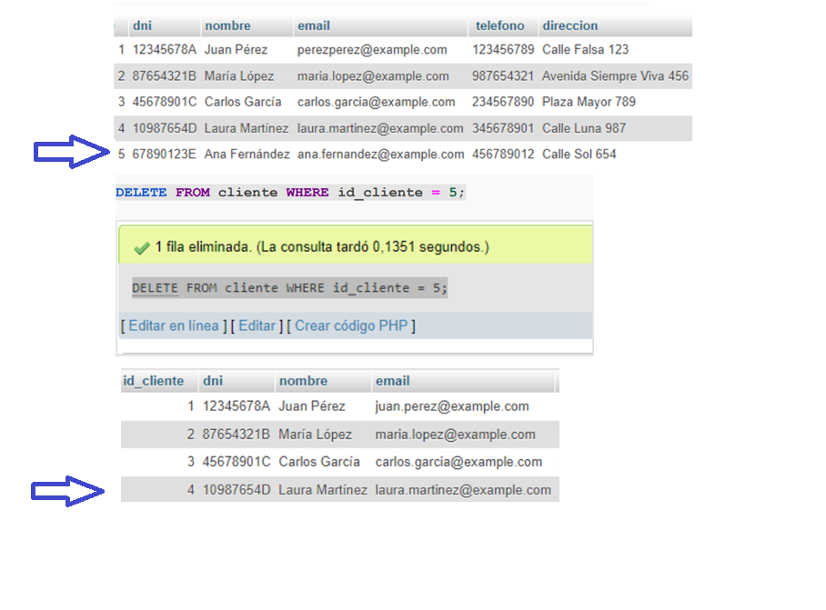
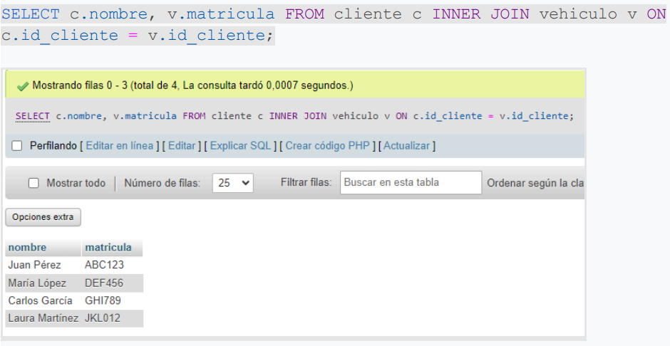
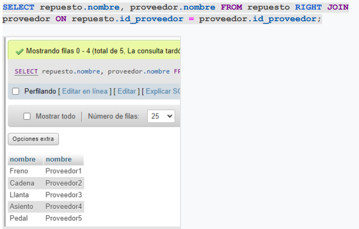
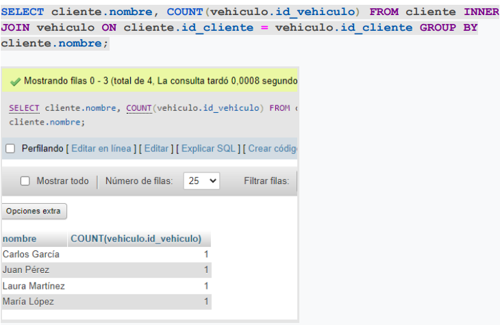
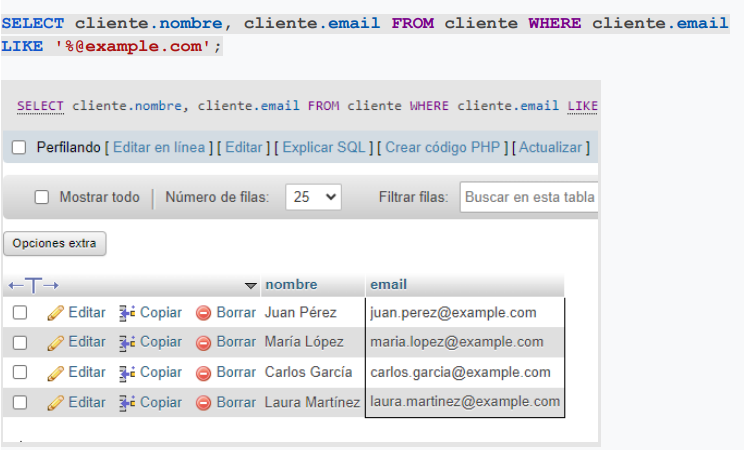
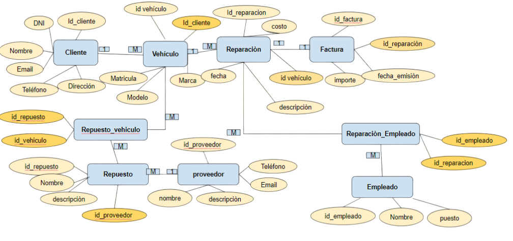

# 🗃️ Proyecto Final - Gestión de Base de Datos

Este proyecto demuestra el diseño, implementación y manipulación de una base de datos relacional como parte del módulo final de GBD.

## 📌 Objetivos

- Aplicar relaciones 1:1, 1:N y M:N
- Crear un modelo entidad-relación normalizado
- Implementar claves foráneas con `ON DELETE CASCADE` y `SET NULL`
- Ejecutar consultas complejas y mantener la integridad de los datos

## 🧱 Estructura del proyecto

| Archivo                        | Descripción                                      |
|-------------------------------|--------------------------------------------------|
| `01_esquema.sql`              | Creación de tablas y relaciones                  |
| `02_datos_prueba.sql`         | Inserción de datos para pruebas                  |
| `03_consultas.sql`            | Consultas SQL (joins, filtros, agrupaciones)     |
| `img/modelo-er.png`           | Diagrama entidad-relación                        |

## 🗃️ <a href="https://drive.google.com/file/d/1F5UXi8OUWIH5r0dmW7J6WpP-VLP0qFTp/view?usp=sharing">¡Clic aqui para obtener el SQL!</a>

## 📊 Consultas incluidas

- `UPDATE` y `DELETE` con integridad referencial

- `INNER`, `LEFT`, `RIGHT JOIN`
  

- `GROUP BY`,`LIKE`, `WHERE`

## 🧩 Modelo Entidad-Relación

## ✅ Conclusión

El proyecto demuestra la aplicación práctica de conceptos fundamentales en bases de datos relacionales, permitiendo el modelado y consulta de un sistema completo, manteniendo la integridad y eficiencia de la información.

