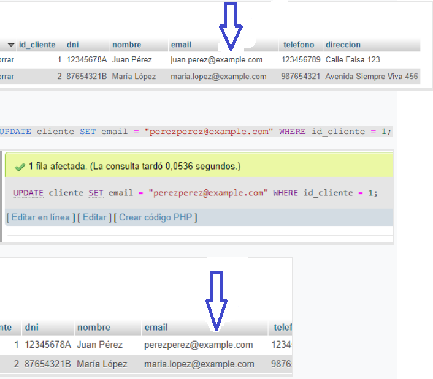
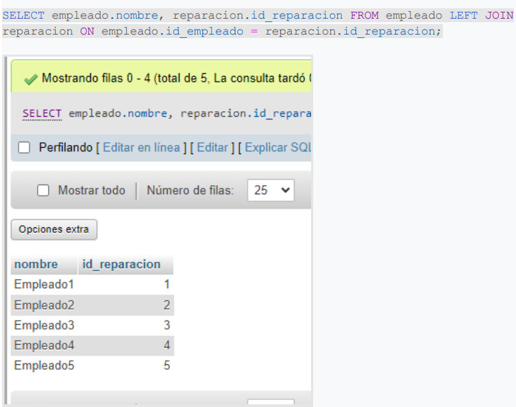

# 🗃️ Proyecto Final - Gestión de Base de Datos

Este proyecto demuestra el diseño, implementación y manipulación de una base de datos relacional como parte del módulo final de GBD.

## 📌 Objetivos

- Aplicar relaciones 1:1, 1:N y M:N
- Crear un modelo entidad-relación normalizado
- Implementar claves foráneas con `ON DELETE CASCADE` y `SET NULL`
- Ejecutar consultas complejas y mantener la integridad de los datos

## 🧱 Estructura del proyecto

| Archivo                        | Descripción                                      |
|-------------------------------|--------------------------------------------------|
| `01_esquema.sql`              | Creación de tablas y relaciones                  |
| `02_datos_prueba.sql`         | Inserción de datos para pruebas                  |
| `03_consultas.sql`            | Consultas SQL (joins, filtros, agrupaciones)     |
| `img/modelo-er.png`           | Diagrama entidad-relación                        |

## 🗃️ <a href="https://drive.google.com/file/d/1F5UXi8OUWIH5r0dmW7J6WpP-VLP0qFTp/view?usp=sharing">¡Clic aquí para obtener el SQL!</a>

---

## 📊 Consultas incluidas

### 🔁 `UPDATE` y `DELETE` con integridad referencial

Modifica datos existentes como el correo electrónico de un cliente o la dirección de un proveedor usando `WHERE` para identificar el registro.

Elimina un cliente y, gracias al uso de claves foráneas con `ON DELETE CASCADE` o `SET NULL`, se gestionan correctamente sus relaciones dependientes (como sus vehículos o reparaciones).

---

### 🔗 `INNER`, `LEFT`, `RIGHT JOIN`

Muestra clientes con vehículos asignados y reparaciones con factura asociada, devolviendo solo coincidencias exactas entre tablas relacionadas.

Devuelve todos los empleados o proveedores, aunque no tengan reparaciones o repuestos relacionados, y completa con `NULL` si no hay coincidencias.

Se utiliza para asegurar que se muestren todos los clientes o proveedores, incluso si no tienen vehículos o repuestos registrados.

---

### 🧮 `GROUP BY`, `WHERE`, `LIKE`

Agrupa datos por nombre de cliente o proveedor y cuenta, por ejemplo, la cantidad de vehículos o repuestos relacionados a cada uno.

Filtra registros con condiciones específicas, como emails que contienen `@example.com` o direcciones con la palabra "Calle".

---

## 🧩 Modelo Entidad-Relación

Representación gráfica de las entidades, claves primarias, relaciones 1:N y 1:1, y las claves foráneas utilizadas en el diseño de la base de datos.

---

## ✅ Conclusión

El proyecto demuestra la aplicación práctica de conceptos fundamentales en bases de datos relacionales, permitiendo el modelado y consulta de un sistema completo, manteniendo la integridad y eficiencia de la información.
